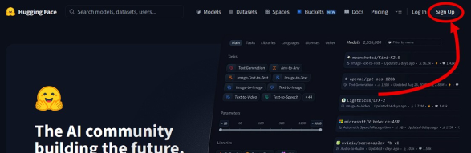
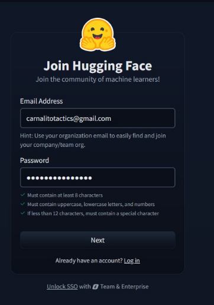
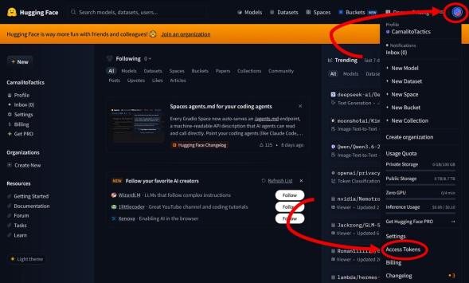
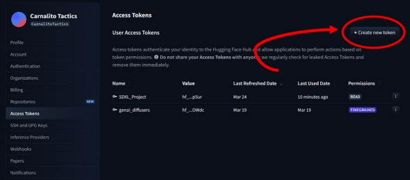
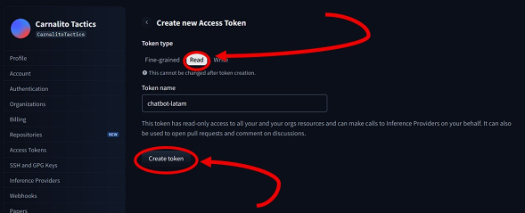
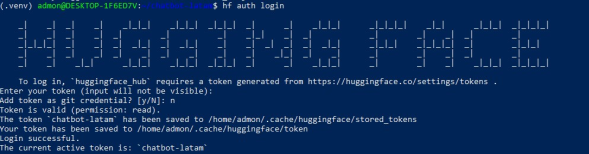

# Iniciar sesión en Hugging Face desde consola

Esta guía explica cómo crear un token de Hugging Face y usarlo en WSL con `hf auth login`.

## 1. Crear cuenta o entrar a Hugging Face

Entra a:

```text
https://huggingface.co/
```

Inicia sesión o crea una cuenta.

```md

```

```md

```

## 2. Ir a Access Tokens

En Hugging Face:

1. Clic en tu foto de perfil.
2. En el menú lateral, entra a `Access Tokens`.

También puedes entrar directamente a:

```text
https://huggingface.co/settings/tokens
```

```md

```

## 3. Crear un token nuevo

Haz clic en `Create new token`.

```md

```

Recomendación para este proyecto:

```text
Token type: Read
```

El nombre puede ser:

```text
chatbot-latam
```

```md

```

Copia el token generado.

Importante: no subas el token al repositorio y no lo pegues en archivos `.md`, `.env` ni capturas públicas.

Aquí puedes agregar una imagen de creación del token:

```md

```

## 4. Activar el entorno virtual

En WSL:

```bash
cd /home/admon/chatbot-latam
source .venv/bin/activate
```

## 5. Instalar Hugging Face Hub

Normalmente ya viene instalado por `sentence-transformers`, pero si el comando `hf` no existe, instala:

```bash
pip install -U huggingface_hub
```

Verifica:

```bash
hf --help
```

## 6. Iniciar sesión desde consola

Ejecuta:

```bash
hf auth login
```

Cuando pida el token, pega el token de Hugging Face.

Si pregunta si quieres guardar el token como credencial de Git, puedes responder:

```text
n
```

Para este proyecto basta con que quede autenticado para descargar modelos.

```md

```

## 7. Verificar sesión

Ejecuta:

```bash
hf auth whoami
```

Si todo salió bien, mostrará tu usuario de Hugging Face.

## 8. Probar descarga del modelo

Desde el proyecto:

```bash
cd /home/admon/chatbot-latam
source .venv/bin/activate
python3 scripts/build_faiss_semantic_index.py
```

Si el modelo no estaba descargado, Hugging Face lo descargará.

## 9. Cerrar sesión si hace falta

Si necesitas cerrar sesión:

```bash
hf auth logout
```

## Problemas comunes

### `hf: command not found`

Solución:

```bash
cd /home/admon/chatbot-latam
source .venv/bin/activate
pip install -U huggingface_hub
```

### Token inválido

Crea un token nuevo en:

```text
https://huggingface.co/settings/tokens
```

Usa permisos de lectura (`Read`) y vuelve a ejecutar:

```bash
hf auth login
```

### No pegar el token en el repo

Nunca guardar tokens en:

```text
README.md
docs/
.env
requirements.txt
scripts/
```

Si necesitas variables privadas más adelante, usa un archivo `.env` local y asegúrate de que esté ignorado por Git.
